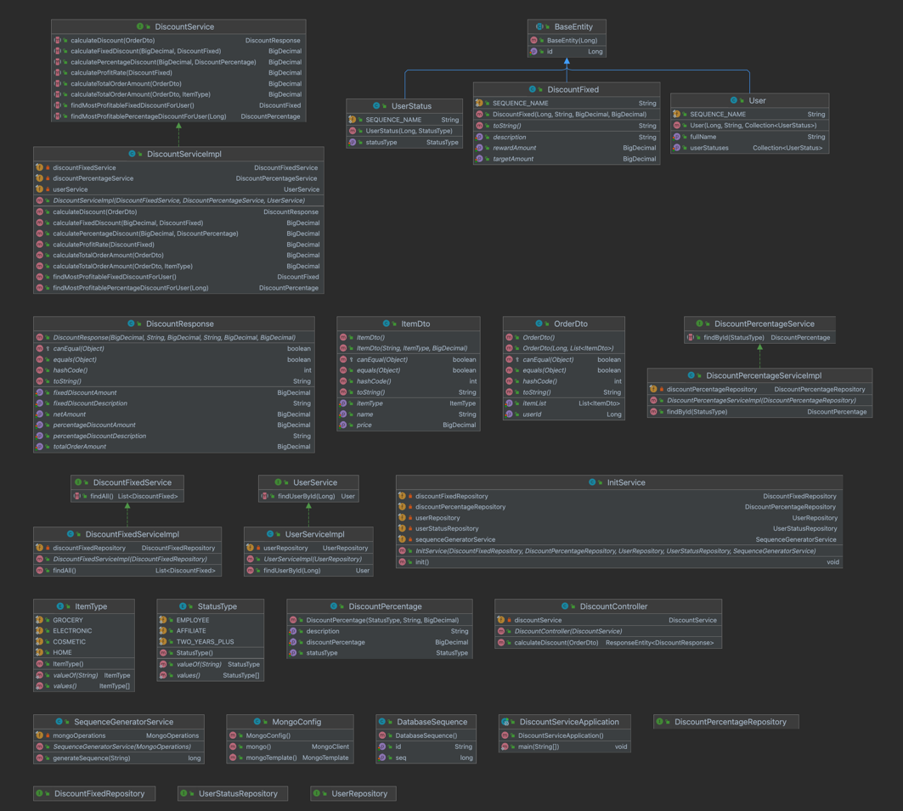
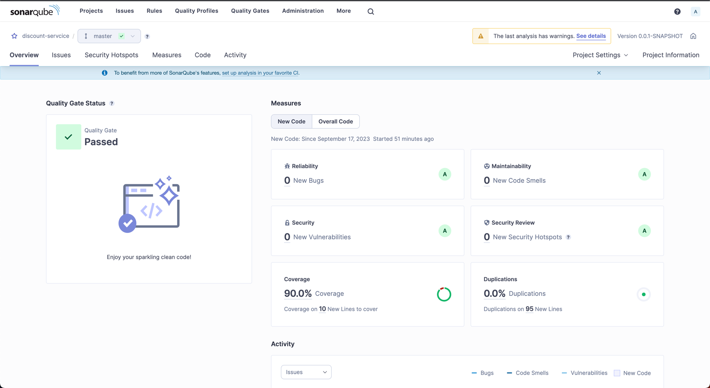

# Read Me First
The following was discovered as part of building this project:

# Getting Started

The project can be built by maven, using command `mvn clean install`,which will also run tests and create the jar if build and tests are successful. 

The jar will be released under target/ folder.

### Docker Compose support
you can run docker-compose.yml file using the command `docker-compose up -f docker-compose.yml` You have to pass the filename since there's another candidate file named `compose.yaml` used for ease of development
In `docker-compose.yml` the following services have been defined:

* mongodb: [`mongo:latest`](https://hub.docker.com/_/mongo)
* discount-service: [`app:latest`]

This project also contains a Docker Compose file named `compose.yaml`.
In this file, the following services have been defined:

* mongodb: [`mongo:latest`](https://hub.docker.com/_/mongo)

Please review the tags of the used images and set them to the same as you're running in production.

### API Documentation

This project is documented with OpenApi(aka. Swagger)
You navigate to this address after running the project:
(http://localhost:8080/swagger-ui/index.html#/)

### UML Class Diagram

Project's detailed UML class diagram can be found in project's base folder.(ProjectUMLClassDiagram.uml)

### SonarQube Report
(Had to share as image since community edition of SonarQube doesn't allow exporting report as html)

### Reference Documentation
For further reference, please consider the following sections:

* [Official Apache Maven documentation](https://maven.apache.org/guides/index.html)
* [Spring Boot Maven Plugin Reference Guide](https://docs.spring.io/spring-boot/docs/3.1.3/maven-plugin/reference/html/)
* [Create an OCI image](https://docs.spring.io/spring-boot/docs/3.1.3/maven-plugin/reference/html/#build-image)
* [Spring Data JPA](https://docs.spring.io/spring-boot/docs/3.1.3/reference/htmlsingle/index.html#data.sql.jpa-and-spring-data)
* [Spring Data MongoDB](https://docs.spring.io/spring-boot/docs/3.1.3/reference/htmlsingle/index.html#data.nosql.mongodb)
* [Spring Web](https://docs.spring.io/spring-boot/docs/3.1.3/reference/htmlsingle/index.html#web)
* [Docker Compose Support](https://docs.spring.io/spring-boot/docs/3.1.3/reference/htmlsingle/index.html#features.docker-compose)

### Guides
The following guides illustrate how to use some features concretely:

* [Accessing Data with JPA](https://spring.io/guides/gs/accessing-data-jpa/)
* [Accessing Data with MongoDB](https://spring.io/guides/gs/accessing-data-mongodb/)
* [Building a RESTful Web Service](https://spring.io/guides/gs/rest-service/)
* [Serving Web Content with Spring MVC](https://spring.io/guides/gs/serving-web-content/)
* [Building REST services with Spring](https://spring.io/guides/tutorials/rest/)

